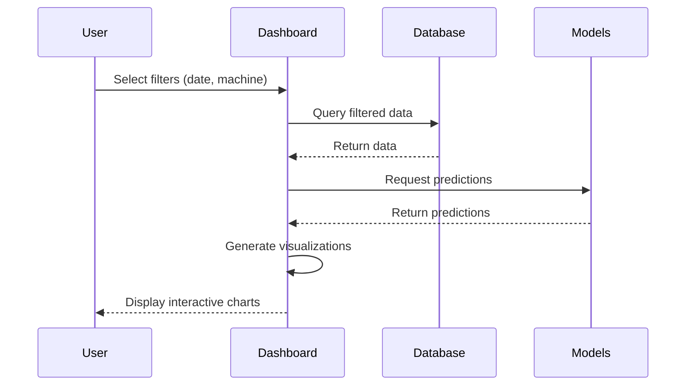

# System Architecture

## Overview

The Smart Manufacturing Dashboard is built with a modular architecture that separates data ingestion, processing, machine learning, and visualization into distinct layers. This document provides detailed technical information about the system design.

## Architecture Layers

### 1. Data Layer

**Purpose**: Ingest and store raw manufacturing data

**Components**:
- **CNC Data Processor** (`src/data_processing/process_cnc_data.py`)
  - Reads 18 CNC experiment files
  - Extracts sensor readings (current, vibration, voltage, etc.)
  - Aggregates features for ML model training
  - Output: `cnc_features.csv`, `cnc_sensor_data.csv`

- **Synthetic Data Generator** (`src/data_generation/generate_synthetic_data.py`)
  - Generates realistic manufacturing data patterns
  - Creates 365 days of hourly production data
  - Simulates 5 CNC machines with varying performance profiles
  - Output: `production_data.csv`, `quality_data.csv`, `maintenance_data.csv`

- **SQLite Database** (`data/manufacturing.db`)
  - Central data store for all processed data
  - Indexed tables for efficient querying
  - Tables: `production`, `quality`, `maintenance`, `cnc_features`, `cnc_sensors`

### 2. Machine Learning Layer

**Purpose**: Train and deploy predictive models

**Components**:
- **Predictive Maintenance Model**
  - Algorithm: Random Forest Classifier
  - Features: 18 CNC sensor metrics
  - Target: Machine failure prediction
  - Output: Risk score (0-100%)
  - Model file: `predictive_maintenance.pkl`

- **Quality Anomaly Detector**
  - Algorithm: Isolation Forest (unsupervised)
  - Features: Quality metrics, defect rates, inspection data
  - Target: Quality anomaly detection
  - Output: Anomaly flag (-1/1) + anomaly score
  - Model file: `quality_anomaly_detector.pkl`

### 3. Application Layer

**Purpose**: Interactive dashboard for monitoring and analysis

**Components**:
- **Streamlit Dashboard** (`dashboard/app.py`)
  - 696 lines of Python code
  - 5 main pages (Overview, Production, Quality, Maintenance, Reports)
  - Real-time data filtering and visualization
  - ML model inference for predictions

## Data Flow Diagram



## Component Details

### CNC Data Processing Pipeline

```python
# Process flow
1. Load experiment CSVs (experiment_01.csv to experiment_18.csv)
2. Extract sensor readings:
   - Current (feed, X1, Y1, Z1)
   - Vibration (table, spindle)
   - Voltage (feed, X1, Y1, Z1)
3. Engineer features:
   - Statistical aggregations (mean, std, min, max)
   - Derived metrics (voltage-current ratios)
4. Label with tool wear status
5. Save to processed/cnc_features.csv
```

### Synthetic Data Generation

```python
# Production data generation
For each hour in 365 days:
  For each of 5 machines:
    - Generate units produced (80-120, Poisson distribution)
    - Calculate utilization (75-98%, normal distribution)
    - Assign status (Running 90%, Down 5%, Maintenance 5%)
    - Add product type distribution
    - Inject realistic variations and anomalies
```

### Database Schema

**Production Table**
```sql
CREATE TABLE production (
    id INTEGER PRIMARY KEY,
    timestamp DATETIME NOT NULL,
    machine_id TEXT NOT NULL,
    units_produced INTEGER,
    utilization_percent REAL,
    status TEXT,
    product_type TEXT,
    shift TEXT
);
CREATE INDEX idx_production_timestamp ON production(timestamp);
CREATE INDEX idx_production_machine ON production(machine_id);
```

**Quality Table**
```sql
CREATE TABLE quality (
    id INTEGER PRIMARY KEY,
    timestamp DATETIME NOT NULL,
    machine_id TEXT NOT NULL,
    inspected_units INTEGER,
    defective_units INTEGER,
    defect_rate REAL,
    defect_type TEXT
);
CREATE INDEX idx_quality_timestamp ON quality(timestamp);
```

### Model Training Pipeline

```python
# Predictive Maintenance Model
1. Load CNC features from database
2. Prepare features (X) and labels (y)
3. Split train/test (80/20)
4. Train Random Forest:
   - n_estimators=100
   - max_depth=10
   - class_weight='balanced'
5. Evaluate on test set
6. Save model and scaler
7. Output metrics (accuracy, precision, recall)

# Quality Anomaly Detector
1. Load quality data from database
2. Engineer features (defect_rate, machine_performance)
3. Standardize features
4. Train Isolation Forest:
   - contamination=0.1 (expect 10% anomalies)
   - n_estimators=100
5. Predict on training data
6. Save model and scaler
```

## Technology Decisions

### Why Streamlit?
- **Rapid development**: Dashboard built in days, not weeks
- **Python-native**: Seamless integration with ML models
- **Interactive widgets**: Built-in filters, date pickers, selectors
- **No frontend code**: Focus on data logic, not HTML/CSS/JS

### Why SQLite?
- **Simplicity**: No server setup required
- **Portability**: Single file database
- **Performance**: Fast for datasets up to millions of rows
- **Integration**: Built into Python standard library

### Why Random Forest for Maintenance?
- **Handles mixed features**: Numerical sensor data
- **Robust**: Less prone to overfitting than deep learning for small datasets
- **Interpretable**: Feature importance analysis
- **Production-ready**: Fast inference, no GPU required

### Why Isolation Forest for Quality?
- **Unsupervised**: No labeled anomaly data required
- **Effective**: Works well for outlier detection
- **Efficient**: Fast training and prediction
- **Threshold flexibility**: Adjustable contamination parameter

## Scalability Considerations

### Current Scale
- **Data volume**: 365 days × 24 hours × 5 machines = ~44,000 production records
- **Storage**: SQLite database ~5-10 MB
- **Processing time**: Data pipeline ~30 seconds
- **Model training**: <1 minute on modern CPU
- **Dashboard load time**: <2 seconds

### Future Enhancements
1. **Database upgrade**: Migrate to PostgreSQL for multi-user access
2. **Real-time streaming**: Integrate Apache Kafka for live data
3. **Distributed training**: Use Spark MLlib for larger datasets
4. **Cloud deployment**: Deploy on AWS/Azure for production use
5. **API layer**: Add REST API for mobile/external integrations
6. **Advanced ML**: Deep learning models (LSTM) for time series prediction

## Security Considerations

- **Data privacy**: Currently uses synthetic data, no real PII
- **Access control**: Add authentication for production deployment
- **Environment variables**: Use `.env` for sensitive configuration
- **Input validation**: Sanitize user inputs in dashboard filters
- **SQL injection**: Use parameterized queries (already implemented)

## Performance Optimization

**Current optimizations**:
- `@st.cache_data` decorator for database queries
- Database indexes on timestamp and machine_id columns
- Lazy loading: Only query filtered date ranges
- Model caching: Load .pkl files once at startup

**Future optimizations**:
- Materialized views for common aggregations
- Redis caching for frequently accessed data
- Async data loading for dashboard
- Model inference batching

## Deployment Architecture

### Local Development
```
User's Machine
├── Python Virtual Environment
├── SQLite Database (local file)
├── Trained Models (.pkl files)
└── Streamlit Server (localhost:8501)
```

### Production Deployment (Proposed)
```
Cloud Infrastructure (AWS/Azure)
├── Application Layer
│   ├── Streamlit App (Docker container)
│   ├── Load Balancer
│   └── Auto-scaling Group
├── Data Layer
│   ├── PostgreSQL (RDS/Azure Database)
│   └── S3/Blob Storage (model files, raw data)
├── ML Layer
│   ├── Model training pipeline (batch jobs)
│   └── Model serving (API endpoints)
└── Monitoring
    ├── CloudWatch/Application Insights
    └── Alert notifications
```

## Testing Strategy

**Current state**: No automated tests (demo project)

**Recommended additions**:
- Unit tests for data processing functions
- Integration tests for database operations
- Model performance tests (accuracy thresholds)
- Dashboard UI tests with Selenium
- Load testing for concurrent users

## Monitoring & Observability

**Recommended additions**:
- Application logging (Python `logging` module)
- Database query performance monitoring
- Model drift detection
- Dashboard usage analytics
- Alert system for data quality issues

## File Organization Philosophy

```
Smart Manufacturing Dashboard/
├── data/           # All data artifacts (ephemeral, gitignored)
├── src/            # Source code (version controlled)
│   ├── data_generation/    # Data creation
│   ├── data_processing/    # Data transformation
│   ├── models/             # ML training logic
│   └── visualization/      # Chart utilities
├── dashboard/      # Application code
├── notebooks/      # Exploratory analysis
└── outputs/        # Reports and figures
```

**Rationale**:
- Clear separation of concerns
- Easy to navigate and maintain
- Follows data science best practices
- Scalable for team collaboration

## Development Workflow

1. **Data changes**: Modify generators → Run `build_data.py`
2. **Model changes**: Update `train_models.py` → Retrain models
3. **Dashboard changes**: Edit `app.py` → Refresh browser
4. **Adding features**: Create new modules in `src/` → Import in pipeline

## Conclusion

This architecture balances simplicity for a demo project with scalability for production use. The modular design allows easy extension and modification of individual components without affecting the entire system.
