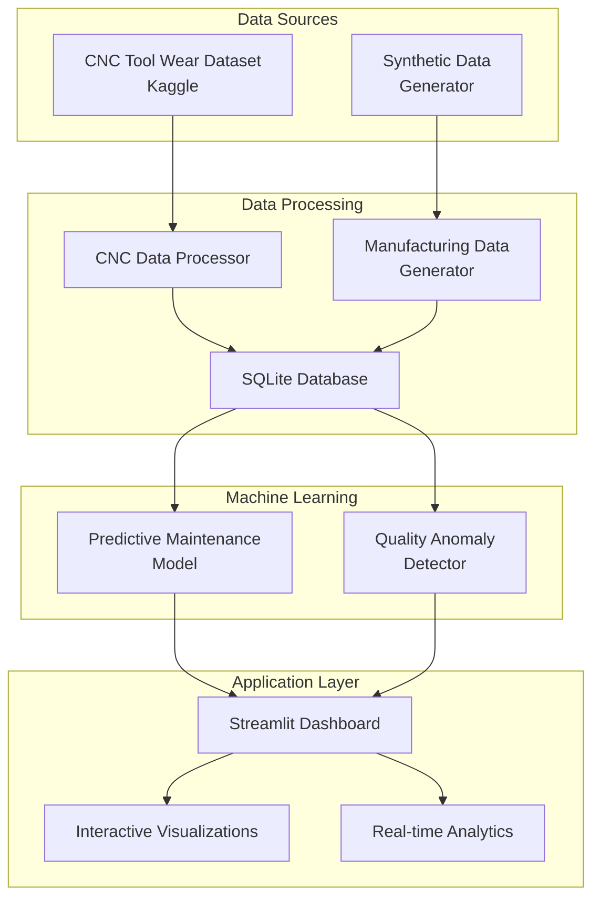
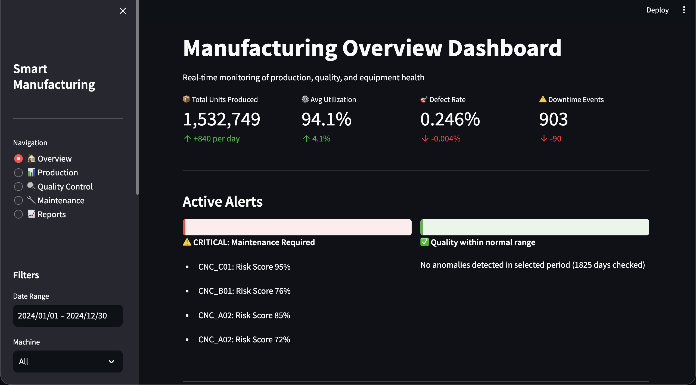
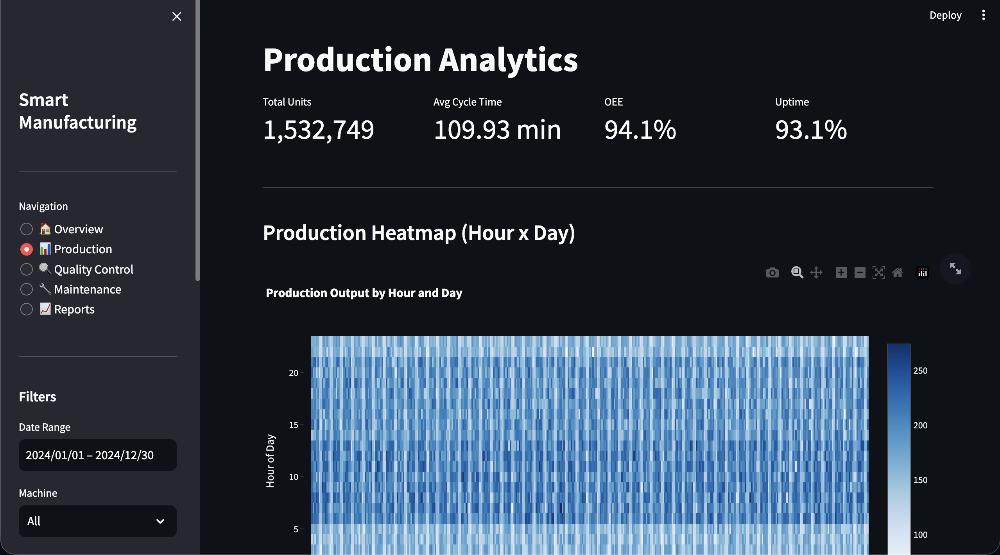
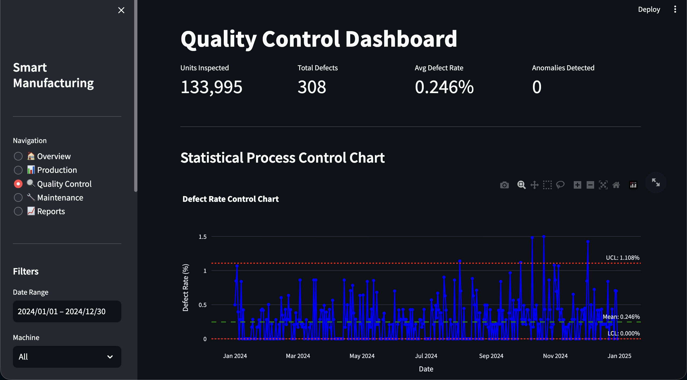
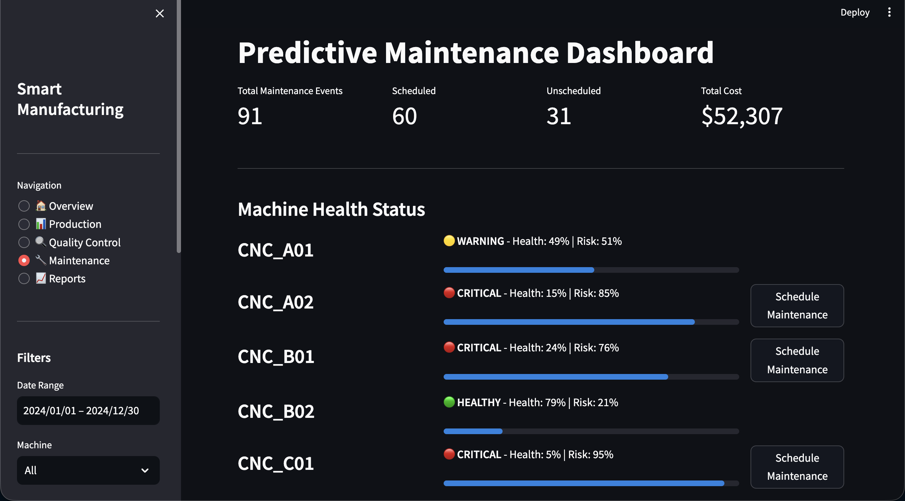
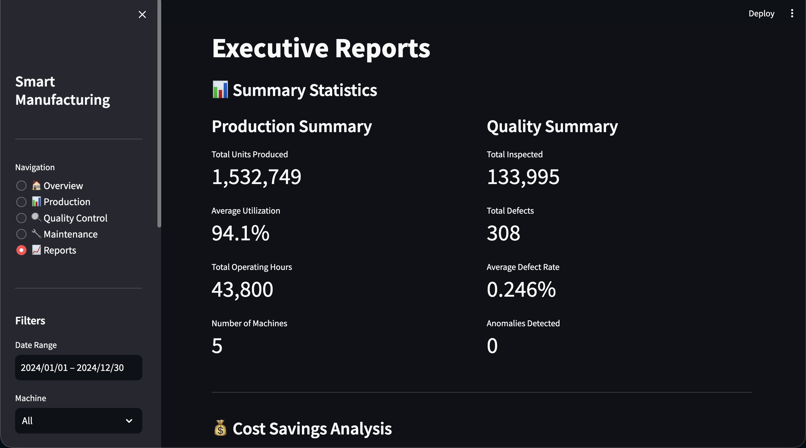

# 🏭 Smart Manufacturing Dashboard for Medtronic


<div align="center">


**An AI-powered manufacturing monitoring system demonstrating predictive maintenance, quality control, and real-time production analytics for medical device manufacturing.**

Built as a demo project for Medtronic Engineering Intern application.

[Features](#-features) • [Quick Start](#-quick-start) • [Documentation](#-documentation) • [Architecture](#-architecture)

</div>

---

## 🎯 Project Overview

This project showcases an end-to-end smart manufacturing solution that combines:
- **Real-time Production Monitoring**: Track manufacturing metrics across multiple machines
- **Predictive Maintenance**: ML-powered predictions to prevent equipment failures
- **Quality Control**: Automated anomaly detection to maintain product quality standards
- **Interactive Analytics**: Power BI-style dashboards for data-driven decision making

### Data Sources

**Real CNC Machine Data:**
- University of Michigan's CNC Mill Tool Wear Dataset (SMART Lab)
- 18 machining experiments with sensor readings
- Current, voltage, position, velocity, and acceleration measurements from X, Y, Z axes and spindle

**Synthetic Manufacturing Data:**
- Generated 365 days of production metrics
- Quality control inspection results
- Maintenance logs and schedules
- Designed to simulate medical device manufacturing workflows

**Why Combined?**
Medical device manufacturing requires monitoring multiple dimensions simultaneously—equipment health, production output, and quality metrics. This integrated approach demonstrates end-to-end manufacturing intelligence.

## ✨ Features

### 📊 **Production Analytics**
- Real-time production monitoring across multiple machines
- Daily/hourly production trends and utilization metrics
- Product mix analysis and machine efficiency tracking
- Downtime event monitoring and alerts

### 🔍 **Quality Control**
- Automated defect detection using Isolation Forest algorithm
- Quality trend analysis with configurable thresholds
- Anomaly score tracking and alerting
- Inspection metrics and defect rate monitoring

### 🔧 **Predictive Maintenance**
- Machine learning-based maintenance risk prediction (Random Forest)
- Equipment health monitoring and failure prediction
- Maintenance event logging and scheduling
- Risk scoring (0-100%) for proactive interventions

### 📈 **Interactive Dashboards**
- 5 comprehensive dashboard pages (Overview, Production, Quality Control, Maintenance, Reports)
- Interactive filters (date range, machine selection)
- Real-time KPI metrics with delta indicators
- Plotly-based visualizations for enhanced interactivity

### 🤖 **Machine Learning Models**
- **Predictive Maintenance Model**: Random Forest classifier predicting equipment failures
- **Quality Anomaly Detector**: Isolation Forest for detecting quality deviations
- Automated model training pipeline
- Feature engineering from CNC sensor data

## 🚀 Quick Start

### Prerequisites
- Python 3.12 or higher
- pip package manager
- 500MB free disk space (for data and models)

### Installation

1. **Clone the repository**
```bash
git clone https://github.com/yourusername/medtronic-smart-manufacturing.git
cd medtronic-smart-manufacturing
```

2. **Create virtual environment** (recommended)
```bash
python -m venv venv
source venv/bin/activate  # On Windows: venv\Scripts\activate
```

3. **Install dependencies**
```bash
pip install -r requirements.txt
```

4. **Download CNC Tool Wear Dataset**
   - Download from [Kaggle: CNC Mill Tool Wear](https://www.kaggle.com/datasets/shasun/tool-wear-detection-in-cnc-mill)
   - Extract the CSV files to `data/raw/` directory
   - The dataset should contain files like `experiment_01.csv`, `experiment_02.csv`, etc.

5. **Build the data pipeline**
```bash
# This will process CNC data, generate synthetic data, and create the database
python build_data.py
```

6. **Train ML models** ⚠️ **REQUIRED**
```bash
# This creates the cnc_predictions and quality_predictions database tables
python src/models/train_models.py
```

> **Important**: You must run the model training script before launching the dashboard. The training process creates essential database tables (`cnc_predictions` and `quality_predictions`) that the dashboard requires to display predictive analytics.

7. **Launch the dashboard**
```bash
streamlit run dashboard/app.py
```

The dashboard will open in your browser at `http://localhost:8501`

### Cloud Deployment (Streamlit Cloud)

For deployment on Streamlit Cloud or other hosting platforms:

1. **Use the cloud-compatible version**:
   ```bash
   streamlit run dashboard/app_cloud.py
   ```
   This version loads data from CSV files instead of SQLite.

2. **Ensure CSV files exist** in `data/processed/` directory:
   - `production_data.csv`
   - `quality_data.csv`
   - `maintenance_data.csv`
   - `cnc_features.csv`
   - `quality_predictions.csv` (optional)

3. **Deploy to Streamlit Cloud**:
   - Push your repository to GitHub
   - Connect to [Streamlit Cloud](https://streamlit.io/cloud)
   - Set main file path to `dashboard/app_cloud.py`
   - Ensure all CSV files are in your repository

## 📁 Project Structure

```
medtronic-smart-manufacturing/
├── data/
│   ├── raw/                    # Raw data (CNC experiments, not in git)
│   ├── processed/              # Processed data CSVs (for cloud deployment)
│   ├── models/                 # Trained ML models (.pkl files)
│   └── manufacturing.db        # SQLite database (generated)
├── src/
│   ├── data_generation/        # Synthetic data generation
│   │   └── generate_synthetic_data.py
│   ├── data_processing/        # Data processing pipelines
│   │   └── process_cnc_data.py
│   ├── models/                 # ML model training
│   │   └── train_models.py
│   └── visualization/          # Visualization utilities
├── dashboard/
│   ├── app.py                  # Main Streamlit app (SQLite-based)
│   └── app_cloud.py            # Cloud version (CSV-based)
├── notebooks/                  # Jupyter notebooks for exploration
├── outputs/
│   ├── reports/                # Generated reports
│   └── figures/                # Saved visualizations
├── build_data.py              # Master data pipeline script
├── setup_project.py           # Project structure creator
├── requirements.txt           # Python dependencies
└── README.md                  # This file
```

## 🏗️ Architecture



### Data Flow

1. **Data Ingestion**: 
   - **Real sensor data**: University of Michigan CNC tool wear data from SMART Lab (18 experiments, Kaggle)
   - **Synthetic data**: Production, quality, and maintenance logs (generated to demonstrate complete system)

2. **Data Processing**:
   - CNC sensor data aggregation and feature engineering
   - Synthetic data generation with realistic patterns (365 days, 5 machines)
   - Database creation with indexed tables for fast querying

3. **Model Training**:
   - Predictive maintenance model trained on CNC features
   - Quality anomaly detector trained on quality metrics
   - Models saved as `.pkl` files for dashboard use

4. **Dashboard**:
   - Loads data from SQLite database
   - Applies filters and transformations
   - Generates interactive visualizations
   - Displays real-time predictions from ML models

## 🛠️ Tech Stack

| Category | Technologies |
|----------|-------------|
| **Core** | Python 3.12 |
| **Dashboard** | Streamlit 1.29.0 |
| **Data Processing** | Pandas 2.1.4, NumPy 1.26.2 |
| **Machine Learning** | Scikit-learn 1.3.2, SciPy 1.11.4 |
| **Visualization** | Plotly 5.18.0, Matplotlib 3.8.2, Seaborn 0.13.0 |
| **Database** | SQLite3 (built-in) |
| **Data Generation** | Faker 21.0.0 |

## 📊 ML Models Details

### Predictive Maintenance Model
- **Algorithm**: Random Forest Classifier
- **Input Features**: 18 CNC sensor metrics (current, vibration, voltage, etc.)
- **Output**: Maintenance risk score (0-100%)
- **Performance**: Trained on 18 CNC experiments with tool wear patterns
- **Use Case**: Predicts when machines require maintenance before failures occur

### Quality Anomaly Detector
- **Algorithm**: Isolation Forest (unsupervised)
- **Input Features**: Defect rate, inspection metrics, machine parameters
- **Output**: Anomaly flag (-1 for anomalies, 1 for normal) + anomaly score
- **Use Case**: Identifies unusual quality patterns that may indicate process issues

## 💻 Usage Examples

### Running the Data Pipeline
```bash
# Process all data and create database
python build_data.py

# Output:
# ✅ Processing CNC data...
# ✅ Generating synthetic data...
# ✅ Creating database...
# ✅ Data pipeline completed successfully!
```

### Training Models
```bash
# Train both ML models
python src/models/train_models.py

# Models saved to: data/models/
# - predictive_maintenance.pkl
# - quality_anomaly_detector.pkl
```

### Launching Dashboard
```bash
streamlit run dashboard/app.py

# Dashboard features:
# - 🏠 Overview: Key metrics and active alerts
# - 📊 Production: Production analytics and trends
# - 🔍 Quality Control: Quality metrics and anomalies
# - 🔧 Maintenance: Equipment health and predictions
# - 📈 Reports: Automated reporting
```

## 🔧 Configuration

### Date Range for Synthetic Data
Edit `build_data.py`:
```python
generator = ManufacturingDataGenerator(
    start_date='2024-01-01',  # Change start date
    num_days=365               # Change duration
)
```

### Machine Configuration
Edit `src/data_generation/generate_synthetic_data.py`:
```python
self.machines = ['CNC-001', 'CNC-002', 'CNC-003', 'CNC-004', 'CNC-005']
```

## 📝 Data Schema

### Production Table
| Column | Type | Description |
|--------|------|-------------|
| `timestamp` | datetime | Production timestamp |
| `machine_id` | string | Machine identifier |
| `units_produced` | int | Units produced in period |
| `utilization_percent` | float | Machine utilization (0-100%) |
| `status` | string | Machine status (Running/Down/Maintenance) |

### Quality Table
| Column | Type | Description |
|--------|------|-------------|
| `timestamp` | datetime | Inspection timestamp |
| `machine_id` | string | Machine identifier |
| `inspected_units` | int | Units inspected |
| `defective_units` | int | Defective units found |
| `defect_rate` | float | Defect rate (0-1) |

### Maintenance Table
| Column | Type | Description |
|--------|------|-------------|
| `timestamp` | datetime | Maintenance timestamp |
| `machine_id` | string | Machine identifier |
| `maintenance_type` | string | Type (Preventive/Corrective/Emergency) |
| `downtime_hours` | float | Hours of downtime |

## 🎨 Dashboard Screenshots

````carousel

**Overview Dashboard** - Real-time KPIs, active alerts, and production trends
<!-- slide -->

**Production Analytics** - Machine utilization, production heatmaps, and performance comparison
<!-- slide -->

**Quality Control** - Statistical process control charts and defect analysis
<!-- slide -->

**Predictive Maintenance** - Machine health status and maintenance risk scoring
<!-- slide -->

**Executive Reports** - Summary statistics and data export capabilities
````

> **Note**: Launch the dashboard with `streamlit run dashboard/app.py` to see the full interactive experience!

The dashboard includes:
- **Overview Page**: Real-time KPIs, active alerts, production trends
- **Production Analytics**: Utilization heatmaps, product mix, machine performance
- **Quality Control**: Defect trends, anomaly detection, quality metrics
- **Maintenance**: Equipment health, risk scoring, maintenance history
- **Reports**: Automated daily/weekly reports with downloadable PDFs

## 🤝 Contributing

This is a portfolio/demo project, but suggestions and feedback are welcome!

1. Fork the repository
2. Create a feature branch (`git checkout -b feature/improvement`)
3. Commit your changes (`git commit -am 'Add new feature'`)
4. Push to the branch (`git push origin feature/improvement`)
5. Open a Pull Request

## 🐛 Troubleshooting

### Database Error: Missing Tables
```
DatabaseError: no such table: cnc_predictions
```
**Solution**: You must train the ML models first to create prediction tables:
```bash
python src/models/train_models.py
```
This creates the `cnc_predictions` and `quality_predictions` tables required by the dashboard.

### Database Error: Missing Production Table
```
Error: no such table: production
```
**Solution**: Run `python build_data.py` to create the database

### Timestamp Parsing Error
```
ValueError: time data "2025-10-25T13:40:51.875725" doesn't match format
```
**Solution**: This has been fixed in the latest version. The dashboard now uses ISO8601 format parsing. Update to the latest code:
```bash
git pull origin main
```

### Model Not Found
```
FileNotFoundError: data/models/predictive_maintenance.pkl
```
**Solution**: Run `python src/models/train_models.py` to train models

### Missing CNC Data
```
Warning: data/raw/experiment_01.csv not found
```
**Solution**: Download the CNC dataset from Kaggle (see [Quick Start](#-quick-start))

### Import Errors
```
ModuleNotFoundError: No module named 'streamlit'
```
**Solution**: Activate virtual environment and run `pip install -r requirements.txt`

### Cloud Deployment Issues
If deploying to Streamlit Cloud:
1. Use `app_cloud.py` instead of `app.py`
2. Ensure all CSV files are in `data/processed/` directory
3. Check that CSV files are not in `.gitignore`
4. Verify Python version compatibility (3.12 recommended)

## 📄 License

This project is licensed under the MIT License - see the [LICENSE](LICENSE) file for details.

## 🙏 Acknowledgments

### Data Sources
- **University of Michigan CNC Research Data**: Real machine sensor data from [CNC Mill Tool Wear Dataset on Kaggle](https://www.kaggle.com/datasets/shasun/tool-wear-detection-in-cnc-mill), collected at the System-level Manufacturing and Automation Research Testbed (SMART). The authentic sensor readings provide a realistic foundation for predictive maintenance modeling.
- **Synthetic Manufacturing Data**: Production, quality, and maintenance data were synthetically generated to demonstrate a complete manufacturing monitoring system beyond just sensor readings.

> **Note**: In a real-world Medtronic deployment, this dashboard would integrate with existing **MES** (Manufacturing Execution System), **QMS** (Quality Management System), and **CMMS** (Computerized Maintenance Management System) to provide comprehensive operational visibility.

### Technologies
- **Streamlit**: For the amazing dashboard framework
- **Plotly**: For interactive visualizations
- **Scikit-learn**: For robust ML algorithms

## 👨‍💻 Author

Built as a demo project for **Medtronic Engineering Intern application**, showcasing skills in:
- Data Engineering & ETL Pipelines
- Machine Learning & Predictive Analytics
- Interactive Dashboard Development
- Manufacturing Process Understanding
- Medical Device Industry Standards

---

<div align="center">

**⭐ If you find this project useful, please consider giving it a star!**

Made with ❤️ for Medtronic

</div>
